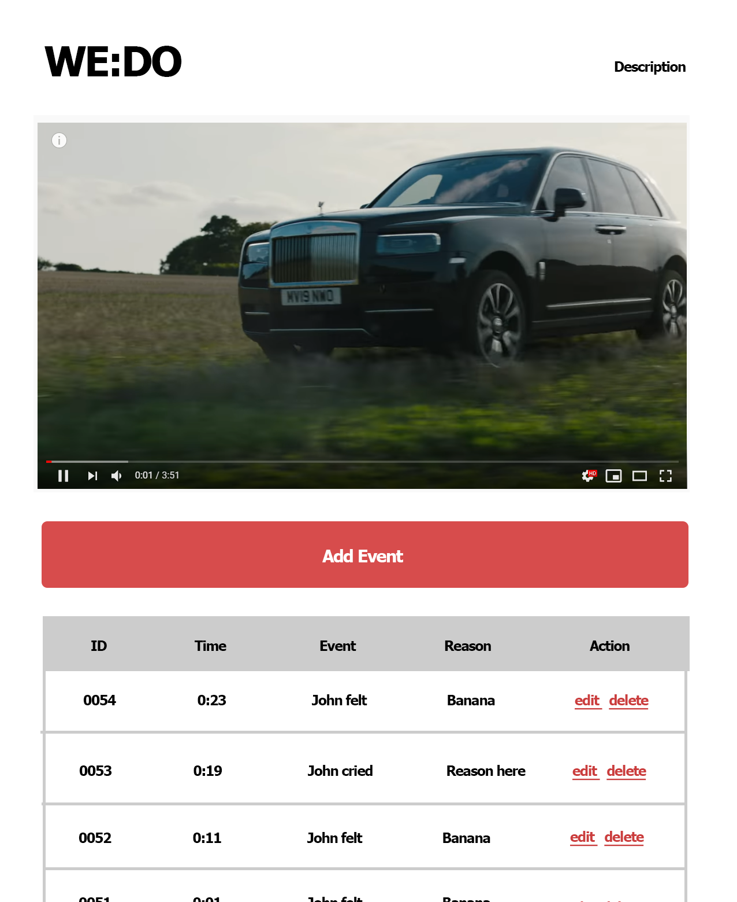

# php-ffmpeg-video-splite
Video spliter which use FFmpeg

# How it works

html5-video-splitter is a small utility to split videos in javascript :
- A web interface to play the video and select the range to extract
- A Node server to call [FFmpeg](https://www.ffmpeg.org/)



## Supported formats :

It supports all videos format available for the ``` <video> ``` tag : mp4, webm and ogg

For more informations see http://www.w3schools.com/html/html5_video.asp

## Requirements :

[FFmpeg](https://www.ffmpeg.org/) must be installed. To ensure it is available, on your command line, run `which ffmpeg`.
This will give you the path where ffmpeg is installed. For example, it might return `/usr/local/bin/ffmpeg`.

Install FFmpeg on OS X : ``` brew install ffmpeg ``` 

Install FFmpeg on Linux : ``` apt-get install ffmpeg ffmpeg ``` 


## How tu use :

Start the node.js server :

``` node video-splitter.js ```

It opens a web page where you can select a video :

1. __Important : Put the videos you want to split in the ``` videos ``` folder__ (see notes)
2. Drag a video or choose a file from the ``` videos ``` folder
2. Select the range in second to split
3. Click on the split button
4. The ouput can be found in the ``` videos ``` folder

## Notes :

For security reasons the browser don't allow to get the path to the videos you choose. We can only access the file name. That's why we assume the videos will be in the ``` videos ``` folder.